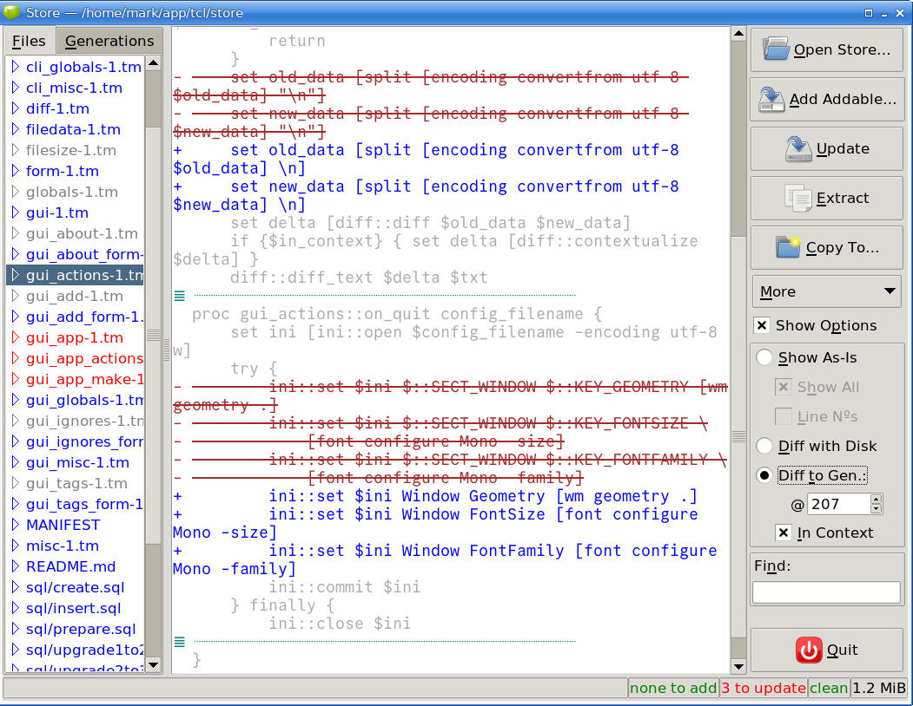

# Store

An easy-to-use and simple alternative to a version control system.

There is a single application, `str` which can be used as a command line
tool or as a GUI application.

## Command Line — str

Add files:

    str a

or

    str add

This will glob the files in the current folder and its immediate subfolders
and filter out ignored and empty files to present a list of unstored files.
It will then prompt for whether to add the files to the store (creating the
store if necessary). It will also prompt for updates.

(Use `str s -q` or `str status --quiet` in a shell script to provide a list
of unstored unignored nonempty files that are candidates to be added; the
`-q` or `--quiet` prevents the interactive prompting to add or update.)

Alternatively, add specified or globbed files like this:

    str a *

or

    str add *

This will add all the specified files apart from those that match the
default ignore globs (e.g., `*.bak`, `*.o`, `*.obj`, etc.).

You can also add, remove, or list the ignores (filenames, folder names, or
globs).

The most common operation is to update the store after changes:

    str u

or

    str update

or, say,

    str u This is an optional comment.

Use

    str s

or `str status` to see if any files need adding or updating.

You can print or extract any previous version of any stored file.
You can diff a previous version against the version on disk or against a
different previous version.

To see if there are any files not in the store that are not ignored (e.g.,
new candidates for adding), run `str s` or `str status`.

You can also extract all the files in a previous “generation” into a new
folder (using the `copy` command).

The command line application is `str`; run `str help` for commands.
The GUI app is `store`.

The generational copies of the added files are stored in _.dirname_.str.

Store does not support branching, staging, or anything else that’s
complicated, making it ideal for small personal projects where you just want
to save regular “generations” of your changes and be able to look back in
time.

## GUI — store

This provides the same facilities as the command line but can be much more
convenient for viewing and diffing previous generations of files.

Run the GUI using:

    str G

or

    str gui

or

    store

where `store` is a soft link to `str`.

## Installation

Unpack anywhere convenient and either put the folder in your `PATH` or add
soft links to `str` and `store`.

The GUI `store` reads `~/.wishinit.tcl` if present. Mine contains:

    tk scaling 1.67
    option add *tearOff 0
    option add *insertOffTime 0
    ttk::style configure . -insertofftime 0
    ttk::style theme use clam

The GUI `store` maintains a configuration file in `~/.config/Store.str`,
(e.g., to save/restore the window size and position) and default font for
showing files.

The command line `str` tool depends on Tcl 9 and the Tcllib; the GUI `store`
tool depends on Tcl 9, Tk 9, the Tcllib, and the Tklib.

## License

GPL-3

---
